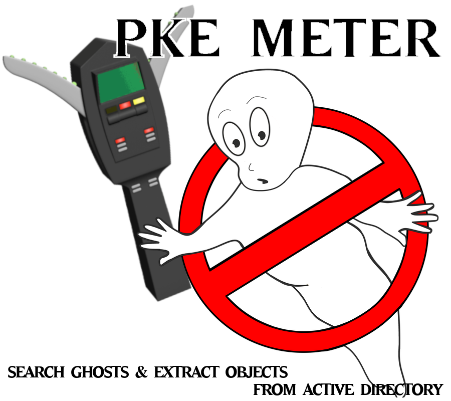

# PKE Meter

## Requirement

Active Directory Powershell module is needed.

## Description

PKE Meter is an automated Powershell script to search "ghosts" and extract objects from Active Directory.

You can easily extract some objects from AD by category.

